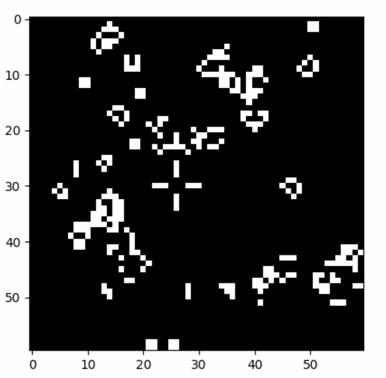

# JDERobot GSoC 2020 Challenges

## Disclaimer

All the work in this repository is my original creation. Including the video and image links attached inthis document


## File Structure


This is the repository for submitting the GSoC 2020 challenge code for JDERobot Academy. 

The file structure of the submission is as follows:-
```
./JDERobot_GSoC
├── README.md
├── src
│   ├── academy_challenge
│   │   ├── gsoc2020-academy_test.pdf
│   │   └── MyAlgorithm.py
│   ├── cpp_challenge
│   │   ├── gsoc2020-c++_test.pdf
│   │   └── src
│   │       ├── CMakeLists.txt
│   │       ├── cpp_challenge.cpp
│   │       └── input.txt
│   └── python_challenge
│       ├── gsoc2020-python_test.pdf
│       └── scripts
│           ├── game_of_life.py
│           ├── gol_application.py
│           ├── patterns.json
│           └── test.py
└── submission_images
    ├── GOL1.png
    └── GOL2.png


```
</br>

## Academy Challenge Solution + Follow Line Exercise Solution

I have solved one of the academy challenges and the follow_line exercise using a PD controller. The video of the same is uploaded to youtube and can be accessed using the following link:-

[Video Solution Here](https://youtu.be/MmXE_dm9IaA)

</br>

## C++ Challenge Solution
The C++ Challenge is present in the folder cpp_challenge/src. The CMakeLists.txt file is used to generate an executable for the program. The following are the instructions to run the code:-
```
cd src/cpp_challenge/src
cmake CMakeLists.txt
make
```
Edit the input file appropriately for setting the input. To tun the executable, run the following
```
./exec
```
Example of the code is:-

INPUT
```
##.##.####.#
##.#..###..#
####..###.##
###...###..#
####..#...##
```
OUTPUT

```
10
##.##0####.#
##.#21###..#
####34###.##
###985###..#
####76#...##
```
</br>

## Python Challenge Solution
The Python Challenge is present in python_challenge/scripts folder. The script is run using python3, and uses numpy as a dependency. Overall the result is displyed in teh terminal, but for easy of visualisation, a matplotlib plot is added.

To test the challenge run the following commands in a terminal:-
```
cd src/python_challenge/scripts
#TEST SCRIPT
python3 test.py

#APPLICATION SCRIPT
python3 gol_application.py

```

Sample images of the environment in matplotlib are shown below:-

<br/>



